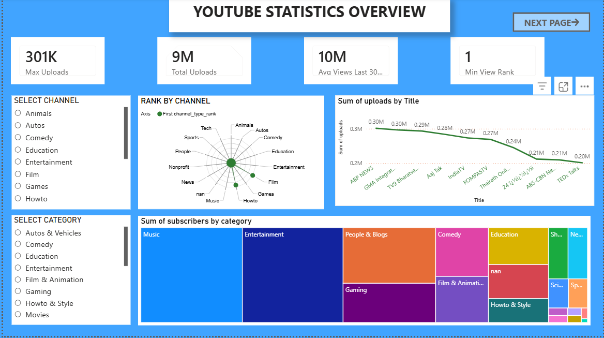
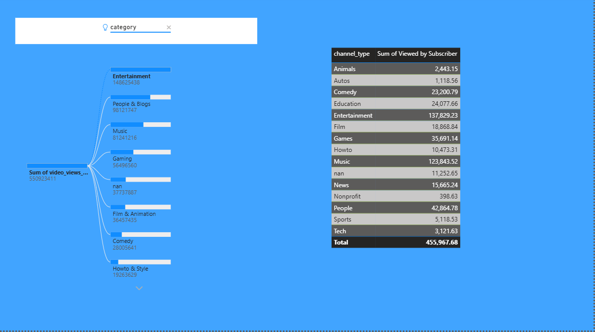

# 📊 Global YouTube Statistics Dashboard

This Power BI project analyzes YouTube data to uncover insights on uploads, views, subscribers, and channel performance.

## 🔍 Key Features
- KPI cards (uploads, views, rank)
- Category-wise subscriber analysis
- Channel ranking (radar chart)
- Views per subscriber (calculated column)
- Interactive visuals with filters
- Page navigation

## 📊 Dashboard Preview

### 🔹 Overview Page

### 🔹 Detailed Analysis Page

## 🛠️ Tools
Power BI Desktop | Power BI Service

## 📁 File
PowerBI_Assignment_Global_YouTube_Statistics_4280.pbix

